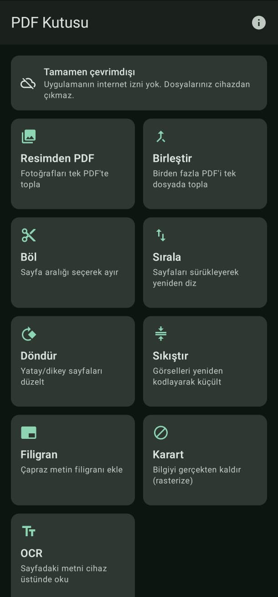

# PDF Kutusu

[](https://github.com/bilalfarukozdemir/pdf-kutusu/actions/workflows/derleme.yml)
[](LICENSE)
[](#i̇zinler)
[](#gereksinimler-ve-kurulum)
[](https://github.com/bilalfarukozdemir/pdf-kutusu/releases/latest)

Tamamen çevrimdışı çalışan, kişisel bir Android PDF okuyucu ve araç kutusu.
**PDF okuma**, resimden PDF, birleştir, böl, sırala, döndür, sıkıştır,
filigran ekle, **karart**, metin çıkar (OCR).

**Hiçbir dosya cihazdan çıkmaz.** Uygulamanın `INTERNET` izni yoktur ve bu bir söz
değil, derleme zamanında doğrulanan yapısal bir kısıttır — bkz. [İzinler](#i̇zinler).

<p align="center">
  
</p>

<p align="center">
  <sub>Ana ekran. Renkler cihazın duvar kâğıdından türetilir (Material You);
  tema sistem ayarını izler.</sub>
</p>

<details>
<summary><b>In English</b></summary>

**PDF Kutusu** ("PDF Box") is a fully offline PDF toolbox for Android.
Images-to-PDF, merge, split, reorder, rotate, compress, watermark, **redact**,
and on-device OCR.

The app requests **zero permissions**. `INTERNET` is not merely absent from the
manifest — a Gradle task fails the build if any capability-granting permission
survives manifest merging, and `assembleDebug` depends on it. CI re-verifies the
produced APK with `aapt dump permissions` on every push.

Redaction is **rasterise-only**: the page is rendered at ≥200 DPI, the selected
rectangles are painted opaque black onto the pixels, and the page is rebuilt from
that bitmap. Drawing a black rectangle over live text is fake redaction and is
rejected by a mandatory test.

Files never leave the device; the original file is never modified. Built with
Kotlin, Jetpack Compose, PdfBox-Android and bundled ML Kit — no AGPL components.

The UI, source identifiers and documentation are in Turkish. Issues and PRs in
English are welcome.

**Download:** [latest release](https://github.com/bilalfarukozdemir/pdf-kutusu/releases/latest)
— pick `arm64-v8a` (21 MB) unless you have an older 32-bit device, in which case
take `universal` (50 MB). Requires Android 8.0 (API 26). Android only; there is
no iOS build and there will not be one.

</details>

---

## İndir

### ⬇️ [**Son sürümü indir**](https://github.com/bilalfarukozdemir/pdf-kutusu/releases/latest)

| Dosya | Boyut | Kimin için |
|---|---|---|
| [`PDF-Kutusu-1.0.0-arm64-v8a.apk`](https://github.com/bilalfarukozdemir/pdf-kutusu/releases/download/v1.0.0/PDF-Kutusu-1.0.0-arm64-v8a.apk) | 21 MB | **Çoğu kişi bunu indirsin.** 2017 sonrası bütün telefonlar `arm64-v8a`. |
| [`PDF-Kutusu-1.0.0-universal.apk`](https://github.com/bilalfarukozdemir/pdf-kutusu/releases/download/v1.0.0/PDF-Kutusu-1.0.0-universal.apk) | 50 MB | Eski 32-bit cihazlar ve emülatörler. Emin değilseniz bunu indirin, her yerde çalışır. |

Aradaki fark yalnızca ML Kit'in OCR modelidir: evrensel sürüm dört işlemci
mimarisi için ayrı kopya taşır, telefonunuz bunlardan yalnızca birini kullanır.

**Kurulum:** APK'yı telefona indirip dokunun. Android bir kerelik "bilinmeyen
kaynak" onayı isteyecektir.

**Gereken:** Android 8.0 (API 26) veya üzeri.
**iOS sürümü yok ve olmayacak** — bkz. [iOS](#ios).

İndirdiğiniz dosyayı doğrulamak isterseniz SHA-256 sağlamaları ve imza
sertifikasının parmak izi
[sürüm notunda](https://github.com/bilalfarukozdemir/pdf-kutusu/releases/tag/v1.0.0)
yazılı.

> Kaynaktan kendiniz derlemek isterseniz:
> [APK derleme ve telefona kurma](#apk-derleme-ve-telefona-kurma)

---

## İçindekiler

- [İndir](#i̇ndir)
- [Okuyucu](#okuyucu)
- [Gereksinimler ve kurulum](#gereksinimler-ve-kurulum)
- [APK derleme ve telefona kurma](#apk-derleme-ve-telefona-kurma)
- [İzinler](#i̇zinler)
- [Mimari](#mimari)
- [Kütüphaneler ve lisansları](#kütüphaneler-ve-lisansları)
- [Resimden PDF](#resimden-pdf)
- [Karartma nasıl çalışıyor](#karartma-nasıl-çalışıyor)
- [Veri nerede duruyor](#veri-nerede-duruyor)
- [Yedekleme](#yedekleme)
- [Testler](#testler)
- [Katkı ve lisans](#katkı-ve-lisans)
- [Bilerek yapılmayanlar](#bilerek-yapılmayanlar)
- [Düşük riskli kullanım uyarısı](#düşük-riskli-kullanım-uyarısı)

---

## Gereksinimler ve kurulum

| Gereksinim | Sürüm |
|---|---|
| JDK | 17 (`JAVA_HOME` ayarlı olmalı) |
| Android SDK Platform | 35 (`compileSdk` / `targetSdk`) |
| Android SDK Build-Tools | 35.0.0 |
| Gradle | 8.10.2 (wrapper ile gelir, ayrıca kurmayın) |
| Android Gradle Plugin | 8.7.3 |
| Kotlin | 2.0.21 |
| minSdk | 26 (Android 8.0) |

SDK bileşenleri kurulu değilse:

```bash
sdkmanager "platforms;android-35" "build-tools;35.0.0"
```

`local.properties` içinde `sdk.dir` SDK yolunuzu göstermelidir. Dosya sürüm
kontrolüne girmez; yoksa `ANDROID_HOME` ortam değişkeni kullanılır.

---

## APK derleme ve telefona kurma

```bash
./gradlew assembleDebug
```

Çıktı: `app/build/outputs/apk/debug/app-debug.apk`

Telefonu USB hata ayıklama açık şekilde bağlayıp:

```bash
./gradlew installDebug
```

Ya da APK'yı doğrudan kurmak için:

```bash
adb install -r app/build/outputs/apk/debug/app-debug.apk
```

APK'yı telefona kopyalayıp dosya yöneticisinden de kurabilirsiniz; bu durumda
"bilinmeyen kaynaklardan kuruluma izin ver" onayı istenir.

### APK boyutu

| Derleme | Ölçülen boyut |
|---|---|
| `assembleDebug` (dört mimari) | **67,0 MB** |
| `assembleDebug -PtekAbi=arm64-v8a` | **38,7 MB** |
| `assembleRelease -PtekAbi=arm64-v8a` | **21,0 MB** ← paylaşmak için bu |

Farkın tamamı ML Kit'in paketli OCR modelidir:
`libmlkit_google_ocr_pipeline.so` her mimari için ayrı gelir (x86_64 11,1 MB +
x86 11,0 MB + arm64-v8a 10,6 MB + armeabi-v7a 6,5 MB = 39,2 MB), ama telefonda
bunlardan **yalnızca biri** kullanılır. Modern telefonların hepsi `arm64-v8a`.

Varsayılanı bilerek "hepsi" bıraktık: üretilen APK her cihazda ve emülatörde
çalışır. Küçük APK istiyorsanız yukarıdaki bayrağı kullanın.

Paketli Noto Sans APK içinde 336 KB yer kaplar (sıkıştırılmış).

Model APK'nın içinde geldiği için OCR çalışırken hiçbir şey indirilmez.

---

## İzinler

### Uygulama hiçbir izin istemez

Çalışma zamanında tek bir izin diyaloğu görmezsiniz. Bunu mümkün kılan üç
karar var:

1. **Dosya erişimi Storage Access Framework (SAF) ile.** Kullanıcı sistem
   seçicisinden dosyayı kendisi seçer; uygulama yalnızca o dosyaya, yalnızca o
   an erişir. SAF izin gerektirmez.
2. **`MANAGE_EXTERNAL_STORAGE` ve geniş depolama izinleri hiçbir koşulda
   istenmez.** Kod tabanında bu izinlerin adı yalnızca *kaldırma* direktifi
   olarak geçer.
3. **ML Kit'in paketli (bundled) modeli** kullanılır. "Unbundled" varyant
   modeli Google Play Services üzerinden indirir; bu ağ erişimi gerektirirdi.

### INTERNET izninin olmadığı nasıl doğrulanır

`app/src/main/AndroidManifest.xml` içinde `android.permission.INTERNET` satırı
**görürsünüz** — ama bu bir izin *talebi* değil, `tools:node="remove"` ile
verilmiş bir *kaldırma direktifidir*:

```xml
<uses-permission android:name="android.permission.INTERNET" tools:node="remove" />
```

Bu satır neden gerekli: ML Kit'in bağımlılık zinciri
(`play-services-basement`, `com.google.android.datatransport`) kendi
manifestlerinde `INTERNET` ve `ACCESS_NETWORK_STATE` tanımlar. Manifest
birleştirici (merger) bu izinleri uygulamanın manifestine ekler. `tools:node="remove"`
onları birleşme sırasında siler.

Doğrulamanın üç katmanı var:

**1. Derleme durur.** `app/build.gradle.kts` içindeki `AgIzniDenetimi` görevi
birleşmiş manifesti okur ve yetenek veren tek bir `<uses-permission>` bulursa
derlemeyi başarısız kılar. `assembleDebug` ve `packageDebug` bu göreve
bağlıdır — yani denetimi atlayarak APK üretmek mümkün değildir.

```bash
./gradlew verifyDebugNoNetworkPermission
```

Rapor: `app/build/reports/izin-denetimi/debug.txt`

**2. Birleşmiş manifeste bakın.**

```bash
grep uses-permission app/build/intermediates/merged_manifests/debug/processDebugManifest/AndroidManifest.xml
```

**3. Üretilen APK'yı denetleyin.** En kesin yöntem budur; kaynak koda değil,
telefona kurulacak dosyaya bakar:

```bash
aapt dump permissions app/build/outputs/apk/debug/app-debug.apk
```

Kurulu uygulamada aynı kontrol:

```bash
adb shell dumpsys package com.yerel.pdfkutusu | grep -A20 "requested permissions"
```

#### Ne görmeniz gerekiyor

`INTERNET`, `ACCESS_NETWORK_STATE` ve depolama izinleri **görünmez**. Ancak
çıktıda tek bir satır olacaktır:

```
uses-permission: name='com.yerel.pdfkutusu.DYNAMIC_RECEIVER_NOT_EXPORTED_PERMISSION'
```

Bu bir yetenek talebi değildir ve gizlenmesi gereken bir şey de değildir:

- `androidx.core` tarafından eklenir; API 33+'ta
  `ContextCompat.registerReceiver(..., RECEIVER_NOT_EXPORTED)` çağrıları
  dinamik yayın alıcılarını korumak için kullanır.
- Adı uygulamanın **kendi paket adıyla** başlar ve koruma seviyesi
  `signature`'dır: yalnızca aynı imzayla imzalanmış kod, yani uygulamanın
  kendisi kullanabilir.
- Kullanıcıya hiçbir izin ekranında gösterilmez ve hiçbir sistem kaynağına
  (ağ, depolama, konum, kamera…) erişim sağlamaz.
- Kaldırılırsa Compose/androidx bileşenleri çalışma zamanında bozulur, bu
  yüzden denetim görevinde açıkça istisna tutulur.

Denetim görevi bu tek desen dışındaki **her** izinde derlemeyi durdurur.

### Kamera izni

Bu sürümde belge tarama özelliği yoktur, bu yüzden kamera izni de yoktur.
Sonradan eklenirse yalnızca o özellik kullanıldığında ve opsiyonel olarak
istenmelidir.

---

## Mimari

```
app/src/main/java/com/yerel/pdfkutusu/
├── cekirdek/          Saf Kotlin: dosya adı temizleme, SHA-256, sayfa aralığı, hata modeli
├── pdf/               PDF motoru (PdfBox-Android + PdfRenderer), coroutine bilmez
│                      Saf alt parçalar: ExifYonu, SayfaYerlesimi (JVM'de test edilir)
├── ocr/               ML Kit metin tanıma sarmalayıcısı
├── veri/              Room: salt-ekleme işlem günlüğü
├── depo/              SAF köprüsü, çalışma alanı, tercihler
├── onizleme/          PdfRenderer tabanlı küçük resim önbelleği
└── ui/
    ├── tema/          Material 3, açık/koyu, dinamik renk
    ├── model/         ViewModel'ler ve ekran durumu
    ├── ortak/         Paylaşılan bileşenler (durum kartları, önizleme, tuval)
    └── ekran/         Araç ekranları
```

### Katman kuralları

- **`pdf/` katmanı coroutine bilmez.** Fonksiyonlar sıradan (blocking) çalışır ve
  bir `IlerlemeDinleyicisi` alır. İptal, dinleyicinin istisna fırlatmasıyla olur:
  ViewModel dinleyicinin içinde `ensureActive()` çağırır. Bu sayede PDF katmanı
  JVM birim testlerinde doğrudan çalıştırılabilir.
- **Rasterleştirme bir arayüz arkasında.** `SayfaRasterlestirici`, karartma ve
  OCR'ın Android'in yerel `PdfRenderer` bileşenine sıkı sıkıya bağlanmasını
  önler; birim testinde sahte bir uygulama kullanılır.
- **Kaynak URI'ye asla yazılmaz.** SAF'tan seçilen her dosya önce uygulama
  alanına kopyalanır. Tüm işlemler kopya üzerinde çalışır, sonuç yeni bir
  dosyadır.
- **Çıktı adı:** `<orijinal-ad>__<islem>__<yyyyMMdd-HHmmss>.pdf`
  Dosya adı temizleyicisi yol ayırıcılarını ve kontrol karakterlerini siler,
  uzunluğu sınırlar ve **Türkçe karakterleri korur**.

---

## Kütüphaneler ve lisansları

| Kütüphane | Ne için | Lisans |
|---|---|---|
| [PdfBox-Android](https://github.com/TomRoush/PdfBox-Android) 2.0.27.0 | PDF okuma/yazma, birleştir/böl/sırala/döndür/filigran/sıkıştır | Apache 2.0 |
| Android `PdfRenderer` | Sayfa önizleme, karartma ve OCR için rasterize | Platform (AOSP, Apache 2.0) |
| ML Kit Text Recognition v2 (`com.google.mlkit:text-recognition` 16.0.1) | Cihaz üstü OCR, **paketli model** | Apache 2.0 |
| Jetpack Compose + Material 3 | Arayüz | Apache 2.0 |
| Room 2.6.1 | İşlem günlüğü (SQLite) | Apache 2.0 |
| AndroidX ExifInterface 1.3.7 | Görsel yön etiketi (platform sürümü HEIF/WebP'de eksik) | Apache 2.0 |
| AndroidX Navigation, Lifecycle, DocumentFile | Altyapı | Apache 2.0 |
| Robolectric 4.13, JUnit 4 | Test | Apache 2.0 / EPL 1.0 |

**AGPL lisanslı hiçbir bileşen kullanılmadı.** MuPDF ve iText bilerek dışarıda
bırakıldı.

### Paketli yazı tipi

`app/src/main/assets/fonts/NotoSans-Regular.ttf` (statik sürüm, 621 KB)

- **Noto Sans** — Copyright The Noto Project Authors
- **SIL Open Font License 1.1** — tam metin: `app/src/main/assets/fonts/OFL.txt`
- Kaynak: [notofonts.github.io](https://github.com/notofonts/notofonts.github.io)
  `fonts/NotoSans/hinted/ttf/NotoSans-Regular.ttf`

Değişken (variable) sürüm bilerek kullanılmadı; dosyada `fvar` tablosu
bulunmadığı doğrulandı. Filigranda PDF'e yalnızca kullanılan harfler gömülür
(`PDType0Font.load(belge, akış, embedSubset = true)`), bu yüzden çıktı birkaç KB
büyür — ölçülen fark **4,4 KB**.

`PDFBoxResourceLoader.init(context)` çağrısı `PdfKutusuUygulamasi.onCreate()`
içinde yapılır. Bu çağrı olmadan PdfBox standart-14 font metriklerini
bulamaz ve ilk filigran/metin işleminde hata verir.

---

## Resimden PDF

Birden çok fotoğraf, ekran görüntüsü ya da taramayı tek bir PDF'te toplar.
Girdi SAF çoklu seçimiyle alınır (`image/*`); **yeni izin istenmez**.

Desteklenen biçimler: JPEG, PNG, WebP, HEIC/HEIF.
HEIC/HEIF çözme Android 9 (API 28) gerektirir; API 26-27'de o dosya net bir
mesajla atlanır, uygulama çökmez.

### Gizlilik: EXIF verisi çıktıya geçmez

Fotoğraflar GPS koordinatı, cihaz markası/modeli ve çekim tarihi taşır.
Görseller bitmap'e çözülüp **yeniden kodlandığı** için üretilen JPEG akışında
hiçbir EXIF bölümü bulunmaz; belge meta verileri de temizlenir.

Bu bir varsayım değil, ölçülen bir güvence:
`ResimdenPdfCihazTesti.exifVerisiCiktiyaSizmaz` GPS ve marka etiketi
yazılmış bir görsel üretir, çıktı PDF'in ham baytlarında `Exif`, `GPS` ve
marka dizesini arar, üçünün de **bulunmadığını** doğrular.

Yön etiketi ise okunur ve uygulanır — aksi hâlde sayfaların yarısı yan yatardı.

### Sayfa düzeni

| Düzen | Davranış |
|---|---|
| **A4'e sığdır** (varsayılan) | Sayfa A4, görsel ortalanır. Kenar boşluğu 0 / 10 / 20 mm. Yatay görselde sayfa da yatay olur. |
| **Görüntü boyutu** | Sayfa = piksel × 72 / DPI (72 / 150 / 300). Kenar boşluğu yok; ekran görüntüleri ve taramalar için. |

En-boy oranı hiçbir düzende bozulmaz — tek bir ölçek çarpanı kullanılır ve bu
`SayfaYerlesimiTesti` içinde %1 toleransla doğrulanır.

### Sıra ve kalite

Varsayılan sıra seçim sırasıdır. Sürükle-bırak ile (basılı tutup yana kaydırma)
değiştirilebilir; ayrıca ada göre ve EXIF çekim tarihine göre hızlı sıralama var.
Kalite seçenekleri ve tahmini çıktı boyutu, sıkıştırma aracıyla **aynı**
`SikistirmaKalitesi` katsayılarından gelir.

### Bellek

12 MP bir fotoğraf ARGB_8888'de ~48 MB tutar; 50 fotoğrafı birden yüklemek OOM
demektir. Bu yüzden görseller teker teker işlenir, önce `inJustDecodeBounds` ile
boyut okunur, `inSampleSize` ile küçültülerek çözülür, her adımda ara bitmap'ler
geri verilir ve belge ana bellek yerine geçici dosyada tutulur
(`MemoryUsageSetting.setupTempFileOnly().setTempDir(...)` — Android'de geçici
dizin açıkça verilmelidir, `java.io.tmpdir` güvenilir biçimde yazılabilir değildir).

İşlem sırasında ilerleme gösterilir ve iptal edilebilir.

OCR / aranabilir metin katmanı bu sürümde yok.

---

## Okuyucu

Uygulama aynı zamanda bir PDF okuyucudur. Telefonda bir PDF'e dokunduğunuzda
"birlikte aç" listesinde çıkar ve **varsayılan okuyucu** yapılabilir.

- Sürekli dikey okuma, parmakla ve düğmeyle yakınlaştırma (%100–500)
- Sayfa göstergesi, okurken ekran sönmez
- Okuduğunuz belgeyi doğrudan **paylaşma** ya da **araçlara devretme** —
  bir şey karartmak istediğinizde uygulamadan çıkmanız gerekmez
- Şifreli belgede parola sorar

Okuyucu ayrı bir aktivitedir: e-postadan açtığınız bir belgede geri tuşu
e-postaya döner, araç ızgarasına değil.

### Akıcılık nasıl sağlanıyor

Üç karar:

**1. Yakınlaştırma görüntüyü büyütmez, sayfayı yeniden çizer.** `graphicsLayer`
ile ölçeklemek bulanık metin demektir. Bunun yerine sayfanın yerleşim genişliği
değişir ve motor o genişlikte yeni bir bitmap üretir — metin her seviyede net.

**2. Çizim hiçbir zaman beklemez.** Her sayfanın ucuz bir sürümü (256 px) arka
planda üretilip önbellekte tutulur. Net sürüm hazır değilse ucuz sürüm
büyütülerek gösterilir, net gelince yerine geçer. Kaydırırken boş kutu olmaz.

**3. Parmak hareketi çakışması yok.** Yakınlaştırma yalnızca **iki parmak**
ekrandayken olayları tüketir; tek parmak kaydırması `LazyColumn`'a dokunulmadan
gider ve listenin geri dönüşüm mekaniği bozulmaz.

Ayrıca genişlik kovalama (256 px adımlar) yakınlaştırma sırasında gereksiz
yeniden çizimi önler, `PdfRenderer` tek bir mutex arkasında seri çalışır
(iş parçacığı güvenli değildir) ve bellek yetmezse çözünürlük yarıya inip
yeniden denenir — büyük bir tarama yüzünden çökmez.

**Cihazda ölçülen** (Redmi 2312DRA50I, A4 sayfa):

| İşlem | Süre |
|---|---|
| Ucuz sürüm (256 px) | 6 ms |
| İlk tam çizim (1080 px) | 12 ms |
| Aynı sayfa yeniden (önbellek) | 0 ms |
| Önbellekten 120 okuma | 3 ms |
| 8 sayfa ardışık, 1080 px | 108 ms (sayfa başına 13 ms) |

Sayfa başına 13 ms, 60 fps'in kare bütçesinin (16,7 ms) altında — sayfalar
ekrana girdiği hızda çizilebiliyor. Önbellekten okuma çağrı başına 0,025 ms,
yani Compose her karede çağırabilir.

### Hata durumları

Varsayılan okuyucu olmak, "kullanıcının bilerek seçtiği dosya" varsayımını
ortadan kaldırır. Ele alınanlar:

| Durum | Davranış |
|---|---|
| Sağlayıcı aranabilir olmayan tanımlayıcı veriyor (boru) | Önbelleğe kopyalanır |
| Şifreli belge | Parola sorulur, PDFBox ile çözülür |
| Bozuk / PDF olmayan / boş dosya | Anlamlı mesaj, çökme yok |
| URI izni geri çekilmiş, dosya silinmiş | Ne olduğunu söyleyen mesaj |
| Tek sayfa bozuk | O sayfa atlanır, belge açık kalır |
| Bellek yetmiyor | Çözünürlük düşürülüp yeniden denenir |

Hepsi `OkuyucuCihazTesti` içinde cihaz üstünde doğrulanıyor.

---

## Çıktıyla ne yapılır

İşlem bitince sonuç kartında üç şey yapabilirsiniz:

- **Adı düzenle** — dosya adı doğrudan orada değiştirilebilir. Uzantı ayrı
  gösterilir ve korunur; ad `DosyaAdi.guvenli` ile temizlenir (Türkçe
  karakterler korunur) ve aynı adda dosya varsa uyarı verilir. Ad diskte de
  değişir, Dosyalar ekranında aynı adla görünür.
- **Paylaş** — dosyayı başka bir uygulamaya gönderir (WhatsApp, e-posta,
  bulut...). `FileProvider` üzerinden geçici bir `content://` okuma izni verilir;
  **yeni bir izin gerektirmez.**
- **Kaydet** — SAF ile seçtiğiniz konuma yazar, dosya cihazda kalır.

> **Paylaşma, "hiçbir şey cihazdan çıkmaz" sözünün bilinçli istisnasıdır.**
> Uygulama kendiliğinden hiçbir şey göndermez ve `INTERNET` izni yoktur; ama
> dosyayı teslim ettiğiniz uygulama onu istediği yere yükleyebilir. Arayüz bunu
> sonuç kartında açıkça yazar.
>
> Paylaşıma yalnızca `cikti/` klasörü açılır. Seçtiğiniz kaynak dosyaların
> kopyaları (`calisma/`) ve geçici dosyalar dışarıya hiç görünmez.

---

## Karartma nasıl çalışıyor

Karartma **yalnızca rasterize ederek** yapılır:

1. İlgili sayfa `PdfRenderer` ile en az **200 DPI** bitmap'e render edilir.
2. Kullanıcının seçtiği dikdörtgenler bitmap'in **piksellerine** opak siyah
   boyanır. Kenarlarda kıl payı kalmasın diye dikdörtgen birkaç piksel
   genişletilir ve JPEG'in 8×8 DCT blok sınırlarına dışarı doğru hizalanır.
3. Sayfa bu bitmap'ten yeniden oluşturulur ve PDF'e yazılır. Orijinal sayfanın
   içerik akışından **hiçbir şey** çıktıya geçmez.
4. Belge meta verileri (yazar, başlık, üretici, XMP paketi) temizlenir.

**Mevcut sayfanın üstüne dikdörtgen çizilmez.** O yöntem sahte karartmadır:
metin PDF'in içerik akışında kalır, kopyala-yapıştır ile ya da `pdftotext`
benzeri bir araçla okunabilir.

Karartılmayan sayfalara dokunulmaz; metinleri seçilebilir kalır.

Arayüz işlemden önce şunu gösterir:

> Karartılan sayfa görüntüye çevrilir, metni artık seçilemez ve dosya boyutu artar.

### Doğrulama

Zorunlu test iki yerde koşuyor:

- `app/src/test/.../KarartmaMetinYoklugTesti.kt` — JVM'de, enjekte edilen
  rasterleştiriciyle. İçinde `12345678901` olan bir PDF üretilir, o alan
  karartılır, çıktıdan metin çıkarılır ve dizenin **bulunmadığı** doğrulanır.
- `app/src/androidTest/.../KarartmaCihazTesti.kt` — cihazda, **gerçek**
  `PdfRenderer` ile. Aynı doğrulamaya ek olarak karartılan bölgenin
  piksellerinin gerçekten siyah, sayfanın geri kalanının hâlâ beyaz olduğu
  ölçülür.

---

## Veri nerede duruyor

Her şey uygulamaya özel alanda; başka uygulamalar okuyamaz, izin gerekmez,
uygulama kaldırılınca silinir.

| Ne | Yer |
|---|---|
| Seçilen dosyaların kopyaları | `filesDir/calisma/` |
| Üretilen çıktılar | `filesDir/cikti/` |
| Geçici dosyalar (şifresi çözülmüş kopya vb.) | `cacheDir/gecici/` |
| İşlem günlüğü | `filesDir/../databases/pdf_kutusu.db` |
| Tercihler | `SharedPreferences: pdf_kutusu_tercihler` |

Cihazdaki tam yol: `/data/data/com.yerel.pdfkutusu/`

Bulut yedeği ve cihaz transferi kapalıdır (`allowBackup=false` +
`res/xml/veri_cikarma_kurallari.xml`). Yani bu dosyalar Google hesabınıza da
yedeklenmez.

### İşlem günlüğü

Tek bir salt-ekleme tablosu: `islem_gunlugu`

| Alan | Açıklama |
|---|---|
| `zaman_damgasi` | Unix epoch, milisaniye |
| `islem_turu` | BIRLESTIR / BOL / SIRALA / DONDUR / SIKISTIR / FILIGRAN / KARART / OCR |
| `girdi_dosya_adi` | Birden fazla girdide hepsi |
| `girdi_sha256` | Çok girdide, girdi özetlerinin özeti |
| `cikti_sha256` | |
| `sayfa_sayisi` | |
| `sonuc` | BASARILI / HATA |
| `hata_mesaji` | |
| `cikti_dosya_adi` | Şartnamedeki listeye ek — günlükten dosyayı bulabilmek için |

DAO'da `@Update` ve `@Delete` işaretli **hiçbir metot yoktur**. Kullanıcı
günlüğü görebilir ve tamamını temizleyebilir; tek tek kayıt düzenleyemez veya
silemez.

---

## Yedekleme

Uygulama içinden:

- **Dosyalar ekranı → "Tümünü bir klasöre aktar"**: üretilmiş tüm PDF/TXT
  dosyalarını SAF ile seçtiğiniz klasöre kopyalar (Google Drive, SD kart, USB —
  seçiciden neyi seçerseniz).
- **Dosyalar ekranı → tek dosya "Kaydet"**: tek dosyayı istediğiniz yere yazar.
- **Günlük ekranı → kaydet simgesi**: işlem günlüğünün tamamını sekmeyle ayrılmış
  bir `.txt` dökümü olarak dışa aktarır.

Geliştirici tarafından (cihaz USB ile bağlıyken):

```bash
adb exec-out run-as com.yerel.pdfkutusu tar c files > pdf-kutusu-dosyalar.tar
adb exec-out run-as com.yerel.pdfkutusu cat databases/pdf_kutusu.db > pdf_kutusu.db
```

`run-as` yalnızca debug imzalı APK'da çalışır.

---

## Testler

```bash
./gradlew testDebugUnitTest          # JVM birim testleri (Robolectric)
./gradlew connectedDebugAndroidTest  # Cihaz/emülatör gerektirir
```

Rapor: `app/build/reports/tests/testDebugUnitTest/index.html`

### Birim testleri — 113 test

| Dosya | Test | Neyi doğruluyor |
|---|---|---|
| `DosyaAdiTesti` | 16 | Türkçe karakterlerin korunması, `../` temizliği, kontrol karakterleri, uzunluk sınırı, çıktı adı biçimi |
| `SayfaAraligiTesti` | 15 | Aralık ayrıştırma; sınır durumlar: tek sayfa, tüm sayfalar, açık uçlu aralık, ters aralık, sınır dışı, sayı olmayan girdi |
| `PdfIslemleriTesti` | 22 | Birleştirme sonrası sayfa sayısı ve sıra, bölme aralıkları, döndürme açısı ve normalizasyonu, sıralama, meta veri temizliği, kaynak dosyanın değişmemesi |
| `KarartmaMetinYoklugTesti` | 12 | **Zorunlu karartma testi** ve çevresi (metin yokluğu, dokunulmayan sayfalar, meta veri, DPI tabanı, geçersiz girdi) |
| `ExifYonuTesti` | 8 | EXIF yön etiketi → dönüş/aynalama eşlemesi; 8 standart değer + tanımsızlar |
| `SayfaYerlesimiTesti` | 16 | En-boy oranının korunması (%1 tolerans), A4 sığdırma, kenar boşluğu, DPI'dan sayfa boyutu, `inSampleSize` seçimi |
| `OkuyucuYerlesimTesti` | 18 | Okuyucunun kaydırma/yakınlaştırma aritmetiği: yakınlaştırma odağının ekranda sabit kalması, küçük adımların sapma biriktirmemesi, kaydırma sınırının ölçekle birlikte büyümesi, sayfasız/sıfır genişlikli/negatif oranlı bozuk girdiler |
| `BekleyenGirdiTesti` | 6 | Okuyucudan araçlara devredilen belge: okumanın kutuyu boşaltmaması (aynı belge birden fazla araca girebilmeli), silinmiş dosyanın sunulmaması |

PDF'e dokunan testler Robolectric altında koşar: PdfBox-Android font
kaynaklarını AAR `assets` klasöründen okur ve bunun için gerçek bir Android
bağlamı gerekir. `robolectric.properties` ile SDK 34'e sabitlenmiştir.
`ExifYonuTesti`, `SayfaYerlesimiTesti`, `OkuyucuYerlesimTesti` ve
`BekleyenGirdiTesti` saf JVM testidir; hiçbiri Android grafik sınıflarına
dokunmaz ve dördü birlikte 40 ms'de biter.

> **İlk çalıştırma yavaştır.** Temiz bir makinede ilk `testDebugUnitTest`
> ~5 dakika sürer: Robolectric `android-all-instrumented-*.jar` (~100 MB)
> indirir ve enstrümante sınıf yükleyici önbelleğini kurar. Sonraki
> çalıştırmalar **~10 saniye**. CI'da `~/.gradle` önbelleğe alınmalıdır.

### Enstrümante testler — 28 test

| Dosya | Test | Neyi doğruluyor |
|---|---|---|
| `BirlestirmeUctanUcaTesti` | 1 | **Uçtan uca mutlu yol**: iki PDF seç → birleştir → önizlemeyi gerçek `PdfRenderer` ile doğrula → dışa aktar → dosya varlığı ve sayfa sayısı |
| `KarartmaCihazTesti` | 1 | Gerçek `PdfRenderer` ile karartma; metin yokluğu + karartılan bölgenin piksellerinin siyah, gerisinin beyaz olması |
| `YaziTipiTesti` | 1 | Filigranda Türkçe karakterlerin birebir korunması + yazı tipinin alt küme olarak gömülmesi (< 100 KB) |
| `ResimdenPdfCihazTesti` | 7 | Sayfa sayısı, **EXIF dönüşünün uygulanması**, **EXIF verisinin sızmaması**, saydam PNG'nin beyaza düzleşmesi, bozuk dosyanın atlanması, büyük görselin küçültülmesi, uçtan uca akış |
| `OkuyucuCihazTesti` | 18 | Gerçek `PdfRenderer` ile açma ve çizim; bozuk/boş/PDF olmayan dosya, şifreli belge, aranabilir olmayan dosya tanımlayıcısı, geri çekilmiş URI izni, önbellek davranışı ve çizim süreleri |

Görsel testleri bilerek enstrümante: Robolectric'in varsayılan (LEGACY) grafik
kipinde `Canvas.drawBitmap` boş geçer, `Bitmap.compress` yer tutucu yazar ve
`getPixel` sıfır döner — yön, saydamlık ve EXIF sızıntısı orada **kod bozukken
de geçerdi**. Saf mantık (yön eşlemesi, yerleşim matematiği) birim testinde.

Dosya seçme/kaydetme adımlarında sistem SAF seçicisi yerine
`ContentResolver`'ın `file://` desteği kullanılır; uygulamanın geçtiği kod yolu
(URI → akış → kopya) aynen çalışır.

> Bazı MIUI/HyperOS cihazlarda Gradle'ın kurulumu aralıklı olarak reddedilir
> (`Failed to install split APK(s)`). Bu durumda APK'ları elle kurup
> enstrümantasyonu doğrudan çalıştırın:
> ```
> adb install -r -t app/build/outputs/apk/debug/app-debug.apk
> adb install -r -t app/build/outputs/apk/androidTest/debug/app-debug-androidTest.apk
> adb shell am instrument -w com.yerel.pdfkutusu.test/androidx.test.runner.AndroidJUnitRunner
> ```

---

## Bilerek yapılmayanlar

- **Office → PDF dönüşümü.** LibreOffice Android'de çalışmaz. Bunu Microsoft
  Office uygulamasından yapın.
- **İmza akışı** (imzacı davet etme, onay kaydı, teslimat takibi). Sunucu ve
  kimlik doğrulama gerektirir; çevrimdışı bir telefon uygulamasında anlamsızdır.
- **PDF'e aranabilir OCR metin katmanı gömme.** v1 kapsamı dışında; OCR sonucu
  ayrı bir `.txt` olarak verilir.
- Hesap, abonelik, telemetri, analitik, bulut senkronu, reklam.

### Bilinen sınırlar

- Sıkıştırma yalnızca **gömülü görseller** üzerinde çalışır. Salt metinden
  oluşan bir PDF'te kazanç yok denecek kadar azdır; arayüz bunu işlemden önce
  söyler.
- Sayfa kopyalayan işlemler (böl, sırala, birleştir) yer imlerini ve form
  alanlarının doldurulabilirliğini koruyamayabilir. Belgede form, imza, şifreleme
  ya da gömülü olmayan yazı tipi varsa işlem öncesi uyarı gösterilir.
- Şifreli belgede parola sorulur ve çalışma kopyasının şifresi kaldırılır;
  **çıktı şifresizdir**. Parola hiçbir yere kaydedilmez.
- ML Kit'in Latin modeli Türkçe'ye özel eğitilmemiştir; `ı/i` ve `ş/s`
  ayrımında hata payı vardır.
- Filigran, paketli Noto Sans'ı gömer. Bir nedenle yüklenemezse cihazın sistem
  yazı tiplerine, en son Helvetica'ya düşer; Helvetica'da `ğ/ş/ı` harfleri
  `g/s/i` olur ve sonuç kartında uyarı çıkar. Hangi kademe seçilirse seçilsin
  her karakter tek tek sınanır, kodlanamayan karakter (emoji, CJK…) değiştirilir
  — filigran işlemi bir karakter yüzünden çökmez.
- Resimden PDF'te HEIC/HEIF, Android 9'dan eski cihazlarda çözülemez; o görseller
  atlanır ve sonuç kartında nedeniyle listelenir.

---

## Katkı ve lisans

| Dosya | Ne var içinde |
|---|---|
| [CONTRIBUTING.md](CONTRIBUTING.md) | Geliştirme ortamı, kod tarzı, test beklentileri ve **değiştirilemeyecek kararlar** |
| [SECURITY.md](SECURITY.md) | Tehdit modeli: ne vaat ediliyor, ne edilmiyor; açık bildirim |
| [CODE_OF_CONDUCT.md](CODE_OF_CONDUCT.md) | Contributor Covenant 2.1 |
| [CHANGELOG.md](CHANGELOG.md) | Sürüm geçmişi |
| [THIRD_PARTY_NOTICES.md](THIRD_PARTY_NOTICES.md) | Bağımlılıklar ve lisansları |

PR göndermeden önce [CONTRIBUTING.md](CONTRIBUTING.md) içindeki
**değiştirilemeyecek kararlar** bölümünü okuyun. Özetle: `INTERNET` izni
eklenmez, karartma yalnızca rasterize ederek yapılır, işlem günlüğü
salt-eklemedir.

### Lisans

Kaynak kod **MIT** lisanslıdır — bkz. [LICENSE](LICENSE).

Depoda birlikte dağıtılan **Noto Sans** yazı tipi kendi lisansını korur
(SIL Open Font License 1.1, `app/src/main/assets/fonts/OFL.txt`).
Tüm bağımlılıkların dökümü: [THIRD_PARTY_NOTICES.md](THIRD_PARTY_NOTICES.md).

AGPL lisanslı hiçbir bileşen kullanılmadı.

### Sürüm derlemesi (paylaşmak için)

Debug derlemeler `android:debuggable="true"` taşır; ADB erişimi olan biri
uygulama verisini inceleyebilir. Başkasına verilecek APK **release** olmalı:

```bash
./gradlew assembleRelease -PtekAbi=arm64-v8a
```

Çıktı: `app/build/outputs/apk/release/app-release.apk` (~32 MB)

#### Kendi imza anahtarınız

`keystore.properties` yoksa release derlemesi **Android'in ortak debug
anahtarıyla** imzalanır. Yandan yükleme için çalışır, ama:

- imza herkesin makinesinde bulunan ortak anahtardır, başkası üzerine
  güncelleme imzalayabilir;
- Play Store'a gönderilemez;
- sonradan gerçek bir anahtara geçerseniz kullanıcılar **önce uygulamayı
  kaldırmak zorunda kalır** (imza uyuşmazlığı).

Bu yüzden dağıtmadan önce kendi anahtarınızı üretin:

```bash
keytool -genkey -v -keystore pdf-kutusu.jks -keyalg RSA -keysize 2048 -validity 10000 -alias pdfkutusu
```

Sonra depo kökünde `keystore.properties` oluşturun:

```properties
storeFile=pdf-kutusu.jks
storePassword=...
keyAlias=pdfkutusu
keyPassword=...
```

`keystore.properties` ve `*.jks` `.gitignore` içindedir; **depoya girmezler.**
Anahtarı kaybederseniz aynı uygulamayı bir daha güncelleyemezsiniz — yedekleyin.

#### R8 küçültmesi

Açıktır: **31,9 MB → 21,0 MB.**

Küçültülmüş APK cihazda doğrulandı — 10 enstrümante testin tamamı bu derlemeye
karşı geçti (PdfBox, ML Kit, Room, EXIF dahil). Tekrarlamak için:

```bash
./gradlew connectedReleaseAndroidTest -PtestBuildType=release
```

Sorun ararken kapatmak için `-PkucultR8=false`.

> `proguard-rules.pro` içinde, yalnızca **küçültülmüş derlemenin test
> edilebilmesi** için birkaç `-keep` kuralı var (kotlin-stdlib, androidx.tracing,
> ExifInterface, uygulamanın kendi sınıfları). Uygulama ile test APK'sı ayrı ayrı
> küçültüldüğü için, test APK'sının çağırdığı ama uygulamanın kullanmadığı
> sınıflar aksi hâlde siliniyor ve test koşucusu çöküyor. Dosyadaki yorumlar
> hangi kuralın hangi hatayı çözdüğünü tek tek anlatıyor. Ölçülen maliyet:
> 20,2 MB → 21,0 MB. Karşılığında dağıttığımız APK'nın ta kendisini test
> edebiliyoruz.

#### iOS

Yok ve olmayacak. Bu native bir Android uygulamasıdır: Kotlin, Jetpack Compose
ve `PdfRenderer` / Storage Access Framework gibi Android platform API'leri
üzerine kuruludur. iOS'ta çalıştırmak yeniden yazmak demektir.

---

## Düşük riskli kullanım uyarısı

**Bu araç kişisel ve düşük riskli kullanım içindir. Resmî, hukuki veya regüle
belgeler için tek başına güvenmeyin.**

- Çıktıyı her zaman açıp gözle kontrol edin.
- Karartma yaptıysanız çıktıdan metin aramayı deneyin.
- Orijinal dosyanız hiçbir işlemde değiştirilmez; şüphede kalırsanız ona dönün.

Bu uyarı uygulamanın ilk açılışında da gösterilir ve "Hakkında" ekranında
kalıcıdır.
